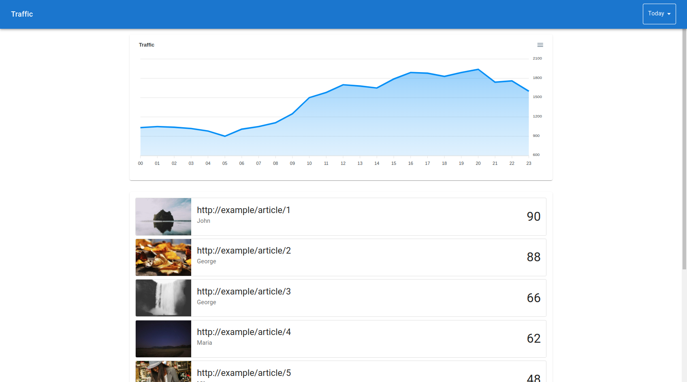
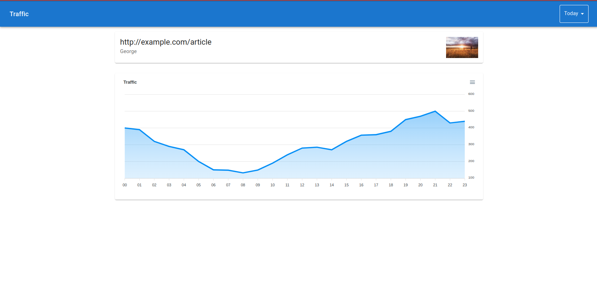
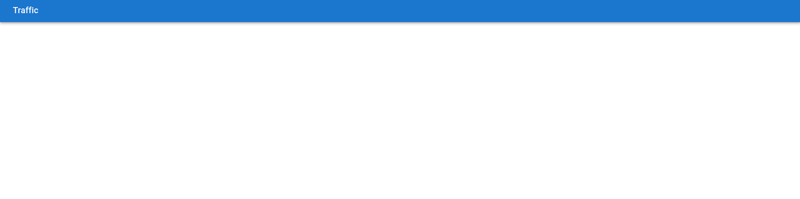
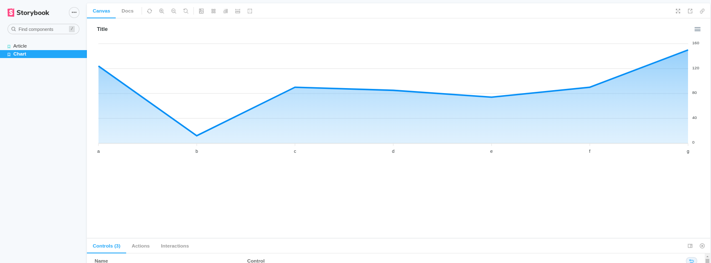
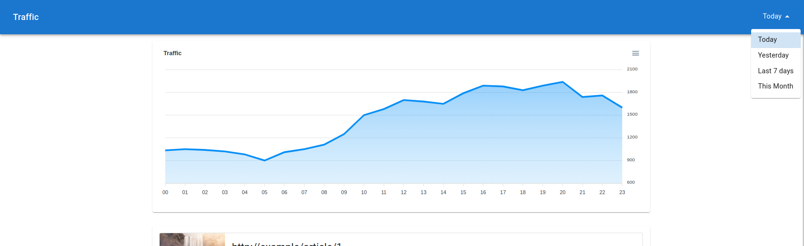

# Full-stack test

The assessment consists in building a dashboard for analyzing publishers site traffic insights.

Dashboard views are

#### Homepage



#### Article Detail




All data for feeding the dashboards can be found in `server/dataset.json`. It has the following shape

```json
{
  "traffic_data": [{
    "id": "c0281ed3-160d-4be0-acc7-1dd9a62a4f78",
    "url": "https://www.example.com/article1",
    "author": "Maximilian",
    "image_url": "https://picsum.photos/600/400?buster=0.4005155557173643",
    "geo": "IT",
    "daily_traffic": [{
      "day": 1,
      "hourly_traffic": [{
        "hour": 0,
        "traffic": 743
      }, {
        "hour": 1,
        "traffic": 149
      }, {
        "hour": 2,
        "traffic": 546
      }, {
        "hour": 3,
        "traffic": 812
      }, ...
      {
        "hour": 23,
        "traffic": 768
      }]
    }, ...
    {
      "day": 31,
      "hourly_traffic": [{
        "hour": 0,
        "traffic": 143
      }, ...
      {
        "hour": 23,
        "traffic": 448
      }]
    }]
  }]
}
```

A basic scaffolding with some components is provided too.

```
# start app
$ npm start

# start server
$ npm run api

# start storybook
$ npm run storybook 
```

#### Base



#### Components collection



## Feature requirements

- Global view
  - Traffic is aggregated from all articles
  - Articles data is displayed ordered by traffic
  - Data can be filtered using top bar selector
  - Clicking on an article should navigate to article details view
- Details view
  - Traffic is aggregated from the article
  - Data can be filtered using top bar selector
- Api
  - should use generated dataset as database
- Time selector
  - Should allow to select a value from:
    - Today
    - Yesterday
    - Last seven days
    - This month


